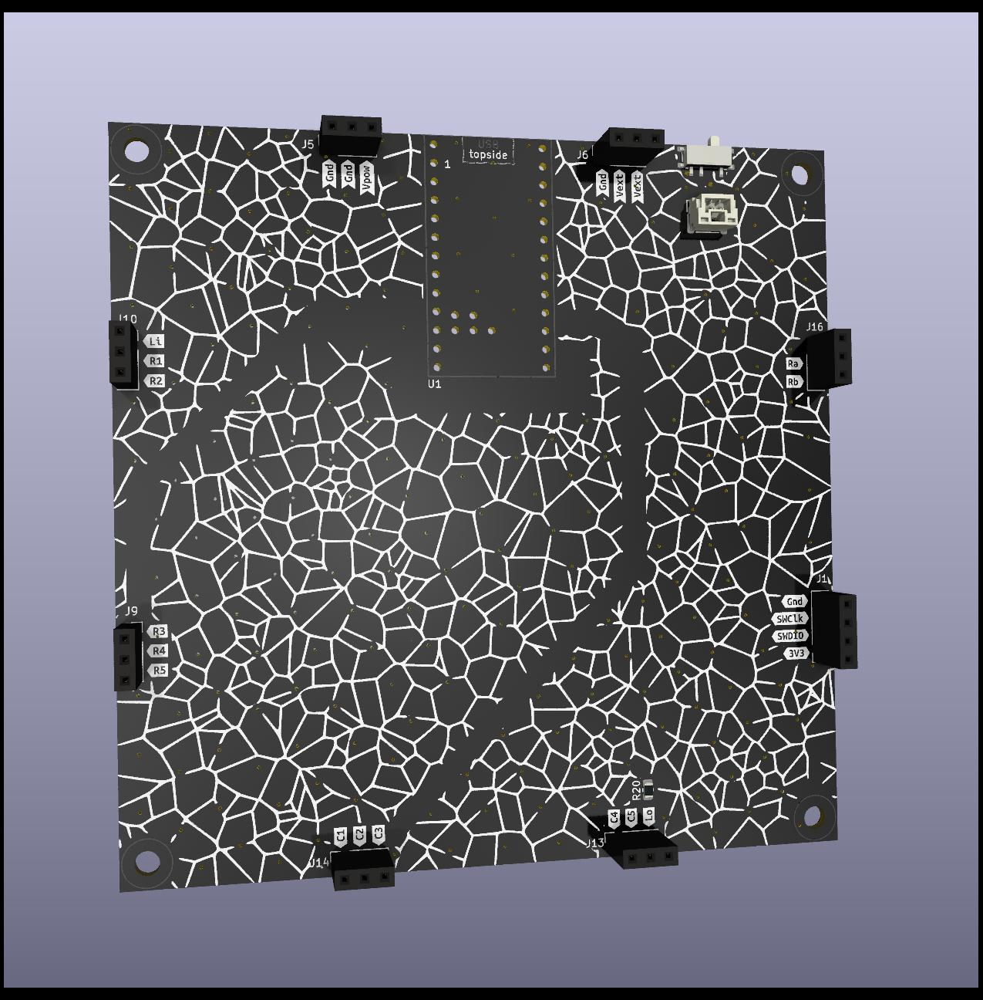
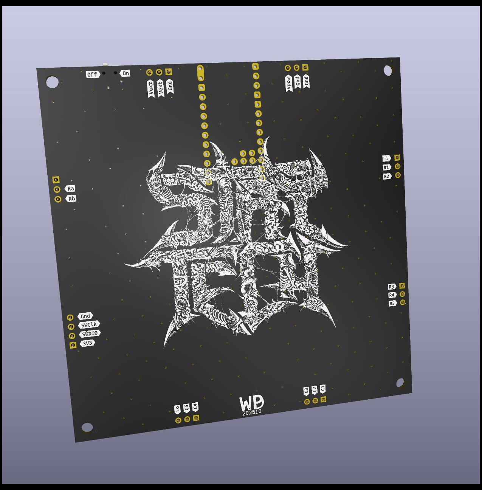
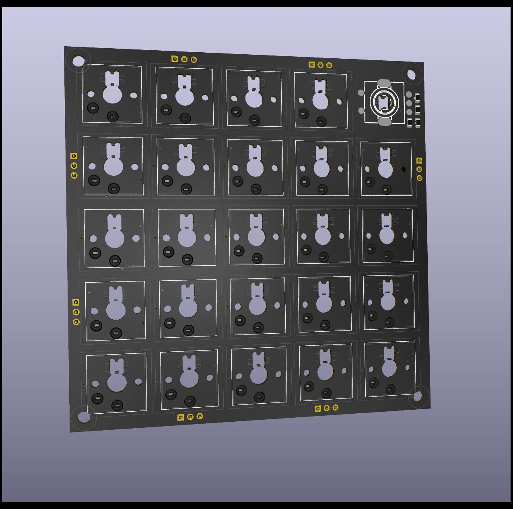
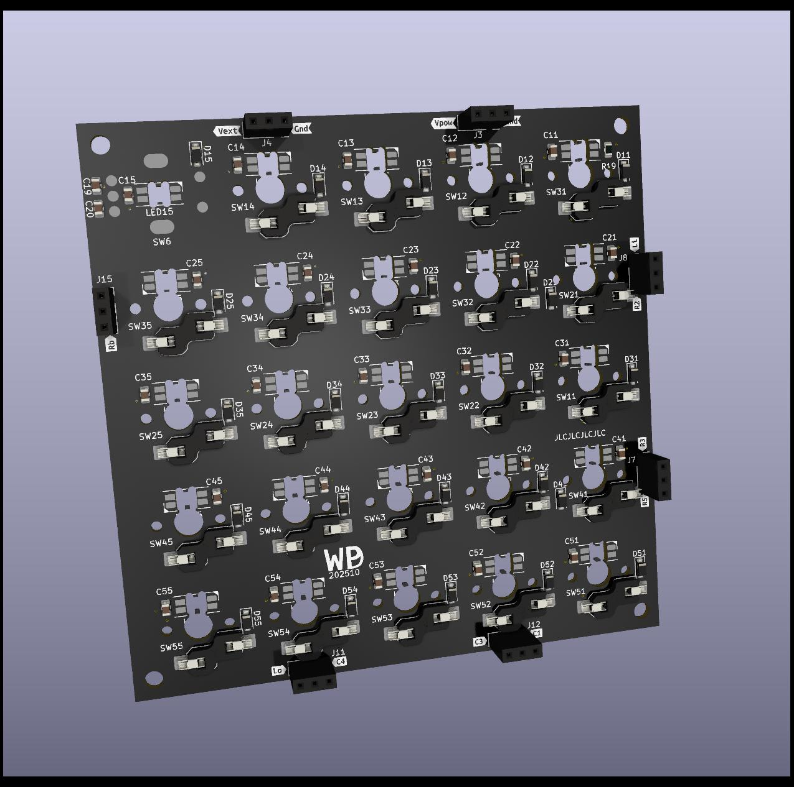
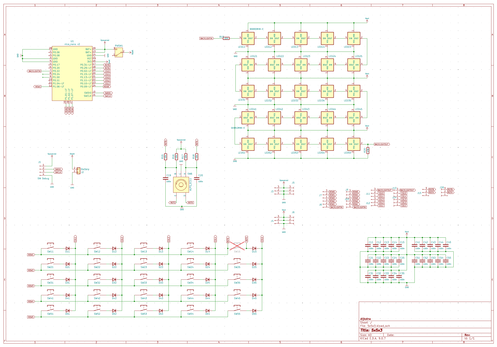
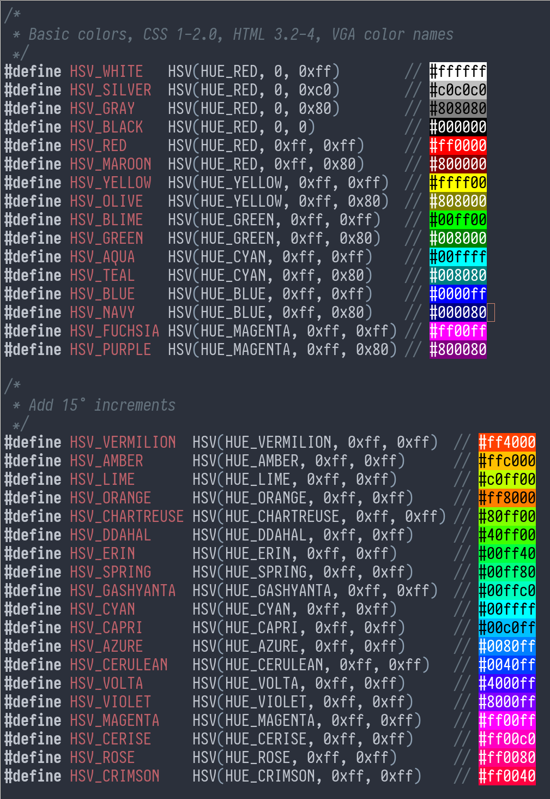

5x5x3
-----

My third take on a 5x5 macro keyboard, built on top of ZMK / Zephyr. The board
is a custom 5x5 matrix carried by a nice!nano v2 module, with a rotary encoder
on the side and a 25-LED SK6803 strip behind the keys.

What this repo adds on top of stock ZMK lives in `zmk-config/` and is loaded as
an out-of-tree Zephyr module:

- **Per-key light groups**. Each of the 25 LEDs is assigned to a group
  (`DESKTOP`, `VOLUME`, `HID`, `BATTERY`, `LAYER`, `ENDPOINT`, `PROFILE`) via
  the `zmk,light-group` and `zmk,behavior-led-layout` bindings. The group's
  current value indexes into a per-group HSV palette (`zmk,color-group` +
  `zmk,behavior-hsv`), so the LED grid reflects keyboard state at a glance:
  desktop number, volume level, output endpoint, BLE profile, layer, caps/num
  lock, battery, etc.
- **Color effects**. `src/color-effect.c` implements smooth HSV transitions
  for state changes, so values fade rather than snap.
- **`lightgroup` shell command**. A Zephyr shell over USB CDC ACM
  exposing `lightgroup battery|desktop|endpoint|hid|
  layer|profile|volume <value>` allows the host to drive the LED state
  directly. This is needed to update `desktop` and can be used to
  debug the other states.
- **Custom board**. `boards/dijkstra/5x5x3` defines the
  nice!nano-based matrix, the rotary encoder node, and the SK6803 SPI
  LED strip.

Schematic
---------

A kicad schematic and layout for 2 boards lives in `schematic`. The
bottom board carries the nice!nano v2, battery, on/off switch,
blackmagic/arm swd programming port, and breaks out to connections for
the top board. The top board is carries Kailh v2 low profile switches,
sk6803 leds underneath each switch.

Default keymap
--------------

The shipping keymap (`zmk-config/boards/dijkstra/5x5x3/5x5x3.keymap`) is a
small worked example of every custom trait above. Excerpt:

    keymap {
        compatible = "zmk,keymap";
        default_layer {
            bindings = <
                &kp F13       &kp F14       &kp F15       &kp F16       &kp K_MUTE
                &kp F17       &kp F18       &kp F19       &kp F20       &kp F21
                &kp RC(LEFT)  &kp LEFT      &kp K_PP      &kp RIGHT     &kp RC(RIGHT)
                &kp K_APP     &kp C_AL_DOCS &kp C_AL_LOCK &kp C_AL_FILES&kp C_AL_WWW
                &out OUT_TOG  &bt BT_NXT    &kp F22       &kp F23       &kp F24
            >;
            sensor-bindings = <&inc_dec_kp C_VOL_UP C_VOL_DN>;
        };
    };

The bottom-left two keys exercise BLE: `&out OUT_TOG` toggles between USB
and BLE output, `&bt BT_NXT` cycles BLE profile slots. The encoder is wired
through `sensor-bindings` to send `C_VOL_UP` / `C_VOL_DN`.

`ledlayout` maps the physical LED order on the SK6803 strip to the row/col
grid (the strip snakes, so row 1 reverses):

    ledlayout {
        compatible = "zmk,behavior-led-layout";
        bindings = [ 00 01 02 03 04
                     09 08 07 06 05
                     0a 0b 0c 0d 0e
                     13 12 11 10 0f
                     14 15 16 17 18 ];
    };

`lightgroup` assigns each LED to a state-driven group. Here rows 1-2 show the
active desktop, row 3 the volume bar, row 4 caps/num lock + battery, row 5
endpoint / BLE profile / active layer:

    lightgroup {
        compatible = "zmk,light-group";
        default_layer {
            bindings = [ LG_DESKTOP  LG_DESKTOP  LG_DESKTOP  LG_DESKTOP  LG_DESKTOP
                         LG_DESKTOP  LG_DESKTOP  LG_DESKTOP  LG_DESKTOP  LG_DESKTOP
                         LG_VOLUME   LG_VOLUME   LG_VOLUME   LG_VOLUME   LG_VOLUME
                         LG_HID      LG_HID      LG_HID      LG_BATTERY  LG_BATTERY
                         LG_ENDPOINT LG_PROFILE  LG_LAYER    LG_LAYER    LG_LAYER  ];
        };
    };

`colorgroup` provides the HSV palette each group indexes into. For example
battery has five colors representing the 0/25/50/75/100% buckets, desktops
have ten colors for ten desktops, endpoints have three (USB + two BLE):

    colorgroup {
        compatible = "zmk,color-group";
        batterys  { colors = <&hsv HSV_MAGENTA &hsv HSV_RED &hsv HSV_YELLOW &hsv HSV_GREEN &hsv HSV_GREEN>; };
        desktops  { colors = <&hsv HSV_CHARTREUSE &hsv HSV_YELLOW &hsv HSV_ROSE &hsv HSV_VIOLET &hsv HSV_AZURE
                              &hsv HSV_MAGENTA &hsv HSV_VOLTA &hsv HSV_CYAN &hsv HSV_SPRING &hsv HSV_CRIMSON>; };
        endpoints { colors = <&hsv HSV_RED &hsv HSV_GREEN &hsv HSV_BLUE>; };
        ...
    };

Together: ZMK events (layer change, BLE profile change, battery level,
HID caps/num indicator, serial cli update) update each group's value,
the group's current value picks a color from the palette, and the LEDs
assigned to that group on the active layer fade to it.

Building
--------

5x5x3 assumes you have `direnv` and that `.envrc` is automatically
sourced. This will setup a local `.venv` and install `west` using
`uv`.

After that you need `zmk` for keyboard source firmware files, `zephyr`
for the rtos source, which includes an usb and bt stack, and the NRF52
hal, and finally an SDK for cross-compiling to NRF52.

 make init

Retrieves the `zmk` and `zephyr` source, and installs all python
modules we need for building.

If you have not developed with `zephyr` before you also need a Zephyr
SDK. Go to the `zmk` directory and run `west sdk install`.

Note that your source directory will balloon to between 1.5 and almost
5GB due to all the downloaded dependencies.

With all deps loaded;

 make build

Will build a lean production firmware that contains;
- BLE
- USB
- kscan in interrupt mode
- shell with just the lightgroup command

 make debug

Will build a debug firmwire with:
- more logging
- kernel/gpio/bt/settings shells
- RTT over the SWD probe
- polling kscan

 make flash

Will attempt to flash the resulting firmware to the board via a Black
Magic Probe at `blackmagic.lan:2022`.

 make serial

Will open a terminal to the keyboard's USB CDC ACM, after it has
attached e.g. via USB.

Debugging
---------
Enable debug logging for zmk:

 log enable dbg zmk

Look at zephyr kernel threads and the amount of stack use of each:

 kernel thread list
 kernel thread stacks
